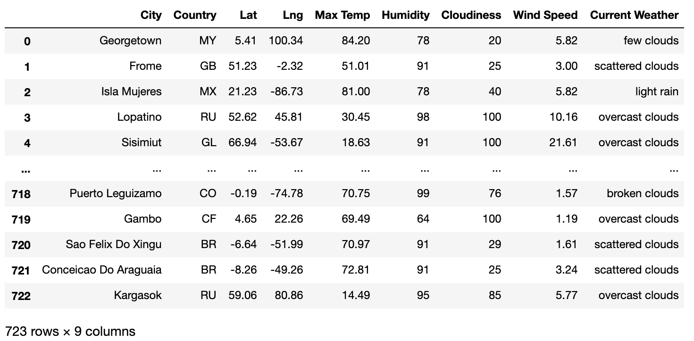
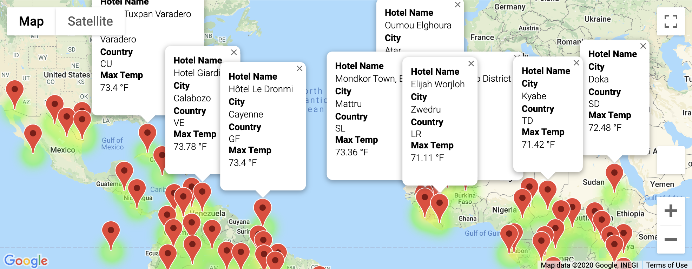
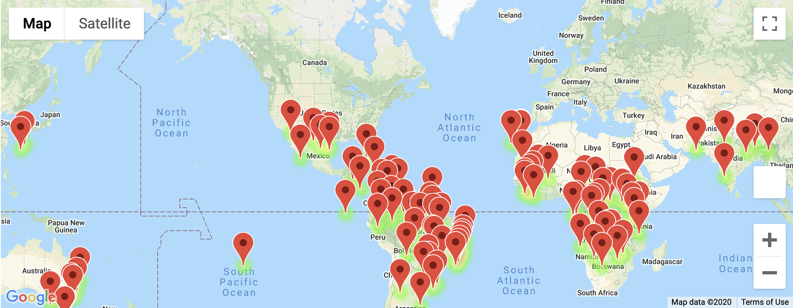
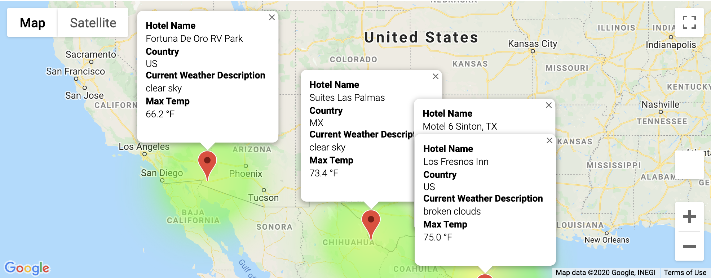

# world_weather_analysis
Module 6

## Weather Database
<B>Create a weather databse to use for vacation search and itenerary planning:</B>
<li>Create a set of 2,000 random latitudes and lomgitudes</li>
<li>Use citipy to find the closest city</li>
<li>Display - Latitude & Longitude, Maximum Tempature, Humidty %, Cloudiness %, Wind Speed, and the Current Weather</li>

## Customer Travel Search

<B>Create a Customer Travel Destinations Map</B>
By using input statements to retrieve customer weather preferences, identify potential travel destinations and pair with nearby hotels. Display the destinations on a marker layer map with pop-up markers.

<li>Import the Weather Database for data</li>
<li>Provide user input to specify minimum and maximum tempature</li>
<li>Display dataframe with Hotel Option</li>
<li>Create a marker layer map with pop-up markers for each city to display destination information</li>

## Travel Itinerary Map

<B>Create a Travel Itinerary Map </B>
Create a route between four cities that are a result of the customer's possible travel destintation from the Customer Travel Destination Map. Display the desitnations on a marker layer layer map with pop-up markers.

<li>Import the Travel Search Database for data</li>
<li>Display a marker layer map from the Travel Search </li>

<li>Create Vacation route for four cities refelctive of the search criteria</li>
<li>Create a marker layer map with pop-up markers for each city on the Itinerary to display destination information</li>

